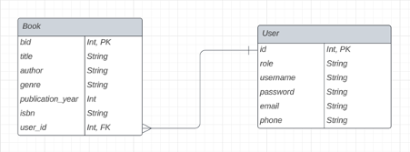

# Library Management System

## Introduction

The Library Management System is a user-friendly application designed to streamline library operations, providing dedicated interfaces for both administrators and users. Built using Tkinter for the graphical user interface and SQLite3 for the database backend, this system offers key features to enhance library management.

### Key Features

1. **Role Based Interfaces**
   - Customized interfaces for users and admins.
   - Easy-to-use features for users to explore the catalog, borrow, return books, and manage profiles.

2. **Admin Privileges**
   - Admins can efficiently oversee and manage the library system.
   - Features include adding new books, updating book details, and managing user accounts.

3. **Database Integration**
   - SQLite3 ensures data integrity and reliability.
   - Efficient information storage in a relational database.

4. **User and Book Properties**
   - Admins can edit user profiles and book properties to maintain accurate records.
   - Modification of user information and database update capabilities.

5. **Language Support**
   - Login page provides an option for users/admins to select a preferred language.
   - Multi-language support for a diverse user base.

## Member-Task Responsibilities

In the development of the Library Management System, team members had specific responsibilities contributing to the project's success.

- **Özlem Elif Tuncer** ([UpbeatJupiter](https://github.com/UpbeatJupiter))
  - User interface design and layout.
  - User functionalities (browsing catalog, borrowing, returning books, change password).
  - Admin privileges implementation.

- **Yusufhan Saçak** ([JosephDoUrden](https://github.com/JosephDoUrden))
  - Book interface design and layout.
  - Book functionalities (adding book, deleting book, updating book).
  - Admin privileges implementation.
  - Language support.

## Database Schema Diagram

## Functionalities

### Language Support

- Language selection before login (with button-3).

### Validation

- All entry widgets have validation.

### Admin Page

- Access option for admin to user or book data.

### Data Functionalities

- Five different options for user data management.

### Adding New User

- New users can be added by admin.
- Validations such as no more than one username can exist in the database.

### User List

- Only admin can access the user database.

### Update User

- User details can be changed by admin with a double click.

### Book List

- Admin has access to the book database after selecting Book Data.

### Adding New Book

- New books can be added with satisfied values based on validations.

### Deleting A Book

- Only admin can delete books by clicking the delete key.

### Editing Books

- Only admin can edit books based on given validations.

### User Page

- After user login, the library welcomes the user.

### Borrowing A Book

- Users can borrow selected books with a double click.

- Library is updated after borrowing.

### Books of User

- Users can see the books they borrowed on the My Books page.

### Returning A Book

- Users can return selected books on the My Books page with a double click.

- My Books page is updated after return.

### Change Password

- The Profile tab allows users to view their details and change their password.

## How to Use

1. Clone the repository.
2. Run the main application file.
3. Follow the on-screen instructions for logging in, browsing the catalog, managing users/books, and more.

Feel free to contribute, report issues, or suggest improvements!

*Include any additional instructions, dependencies, or setup information as needed.*

**Note:** Insert the actual database schema diagram and any missing details specific to your project.
